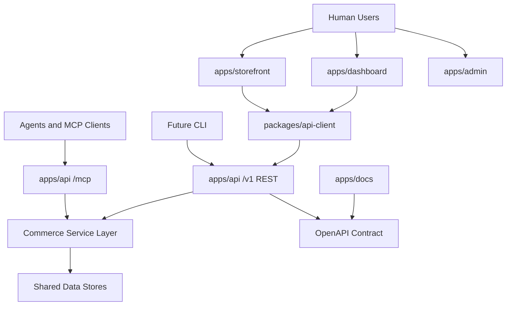

# API-First Agent Architecture Audit

Date: 2026-06-08

## Executive Summary

Prood already has a credible API-first foundation. `apps/api` is the intended source of truth for commerce, exposes REST under `/v1`, serves OpenAPI at `/v1/openapi.json`, exposes MCP at `/mcp`, and advertises Agent Auth discovery at `/.well-known/agent-configuration`.

The gap is not that the API layer is missing. The gap is that the contract is not yet strict enough to be the only interface humans, agents, MCP clients, generated clients, and a future CLI can trust. The most important fixes are to make OpenAPI fully typed, align MCP with OpenAPI operation IDs, remove docs/code drift, add Bearer Agent Auth support to `@prood/api-client`, and replace fragmented scripts with a first-party CLI.

This project is still dev-only, so the remediation should use breaking changes where they produce a cleaner architecture. Do not preserve unshipped behavior with shims, backfills, compatibility wrappers, or fallback paths.

## Source-Backed Baseline

Context7 research used for this audit:

- Next.js `v16.2.2` Route Handler docs: App Router route handlers are suitable for API endpoints, support standard HTTP methods, use Web Request/Response APIs, expose segment runtime options, and are not cached by default.
- MCP TypeScript SDK docs: tools should define input schemas and can return both `content` and `structuredContent` with output schemas.
- `openapi-typescript` / `openapi-fetch` docs: strong client typing depends on OpenAPI paths including request schemas, success response schemas, and error response schemas.

## App Inventory

| App | Role | API posture | Main concern |
| --- | --- | --- | --- |
| `apps/api` | Commerce API, auth, MCP, webhooks | Source of truth for `/v1`, OpenAPI, Agent Auth, MCP | Contract is incomplete for responses and runtime auth channels |
| `apps/storefront` | Tenant storefront | Browser BFF plus `@prood/api-client` consumer | Has local tenant/auth paths and checkout bridge outside OpenAPI |
| `apps/dashboard` | Merchant admin | Uses `@prood/api-client` for commerce, direct DB for some platform concerns | Mixed API-first and direct DB ownership |
| `apps/checkout` | Hosted payment UI and sessions | Separate internal API | Checkout contract is outside Commerce OpenAPI/MCP |
| `apps/admin` | Platform operator console | Direct shared DB/admin queries | Not API-first; no typed operator API |
| `apps/web` | Marketing | No runtime API contract | Informational only |
| `apps/docs` | Human and LLM docs | Syncs OpenAPI and exposes `llms.txt` routes | Docs drift from MCP implementation |

## Current Architecture



## Contract Findings

### P0: OpenAPI success responses are not a full contract

`apps/api/lib/openapi.ts` defines request schemas and operation IDs, but most success responses are only descriptions such as `Success`, `OK`, or `Cart created`. That means `packages/api-client/src/schema.ts` cannot provide reliable `data` types for generated clients.

Impact:

- `openapi-fetch` can type paths and inputs, but not the actual response payloads.
- Agent Auth capabilities are discoverable, but agents cannot infer result shapes from the contract.
- A future CLI would need handwritten response typing or unsafe casts.

Clean fix:

- Add Zod output schemas for every operation.
- Generate OpenAPI success and error response content from those schemas.
- Regenerate `apps/docs/openapi/commerce.json` and `packages/api-client/src/schema.ts`.
- Fail CI if generated artifacts drift.

### P0: OpenAPI omits runtime auth channels

Runtime auth supports:

- Agent Bearer JWT via `Authorization: Bearer`
- API key via `x-api-key`
- Better Auth session cookie
- Storefront tenant resolution via `x-storefront-host`
- Webhook secrets/signatures for payment callbacks

The OpenAPI `securitySchemes` only declares API key and session cookie. Bearer Agent Auth, `x-storefront-host`, checkout secret, and provider signatures are only documented in prose or code.

Clean fix:

- Add `bearerAuth` security scheme for Agent Auth JWTs.
- Document `x-storefront-host` as an explicit tenant-routing header where supported.
- Give webhooks their own security documentation in OpenAPI instead of inheriting storefront security.
- Make public routes such as `/health` explicitly public instead of accidentally inheriting route defaults.

### P1: One route bypasses boundary validation

`apps/api/app/v1/carts/[id]/place-order/route.ts` manually parses JSON as `{ email?: string }` while OpenAPI declares a `placeOrderBody` schema in `apps/api/lib/openapi.ts`.

Clean fix:

- Move `placeOrderBody` into `apps/api/lib/schemas.ts`.
- Use `readBody(req, placeOrderBody)` in the handler.
- Reuse the same schema for OpenAPI and any MCP/CLI input.

### P1: Generated client unwrap is unsafe

`packages/api-client/src/index.ts` exposes `unwrap<T>()`, which throws raw `error` and casts `data as T`. This undercuts the value of generated types.

Clean fix:

- Remove generic caller-provided `T` from `unwrap`.
- Let `openapi-fetch` infer `data` and `error` from generated `paths`.
- Export typed error helpers based on the normalized `CommerceErrorBody`.
- Add `bearerToken` support to `createCommerceApiClient`.

## MCP and Agent Findings

### P0: MCP does not mirror OpenAPI

`apps/api/lib/openapi.ts` defines roughly 45 operations via `pathItem(...)`. `apps/api/lib/mcp/tools.ts` registers 14 MCP tools.

Implemented MCP tools:

- Catalog: `list_products`, `get_product`, `list_categories`, `get_store`
- Cart: `create_cart`, `get_cart`, `add_cart_item`, `update_cart_item`, `apply_cart_coupon`
- Orders: `get_order`
- Admin: `admin_list_products`, `admin_create_product`, `admin_list_orders`, `admin_get_dashboard`

Missing MCP coverage includes:

- `removeCartItem`
- `removeCartCoupon`
- shipping and billing address setters
- shipping method and payment method listing
- `setCartShippingMethod`
- `placeOrder`
- customer order listing
- admin product get/update/delete
- admin category create/update/delete parity
- admin order get/cancel/history/fulfill/refund
- admin customers
- admin store get/update
- admin inventory
- webhook operations should likely stay REST-only and not become tools

Clean fix:

- Decide that MCP tool names are OpenAPI `operationId`s.
- Rename existing tools from snake_case to camelCase.
- Add missing tools for all agent-appropriate operations.
- Keep webhooks REST-only and explicitly document that exclusion.

### P0: MCP docs are currently inaccurate

`apps/docs/content/docs/apps/api/mcp.mdx` says tools mirror REST operation IDs and lists camelCase names such as `listProducts`, but implementation registers snake_case names such as `list_products`.

Clean fix:

- Update code to match docs, not the other way around.
- Make docs generated or checked from the tool registry to prevent drift.

### P1: MCP returns text-only JSON instead of structured content

`apps/api/lib/mcp/tools.ts` returns:

```ts
content: [{ type: "text", text: JSON.stringify(data, null, 2) }]
```

The MCP SDK supports `structuredContent` and output schemas. Agents should not have to parse text JSON.

Clean fix:

- Return both readable `content` and machine-usable `structuredContent`.
- Add output schemas once OpenAPI response schemas exist.
- Normalize MCP errors to the same `{ code, message, errors? }` shape as REST.

### P1: Agent Auth is strong but operationally incomplete

`apps/api/lib/auth/agent-config.ts` correctly derives capabilities from OpenAPI operation IDs. However:

- OpenAPI proxy execution requires one `AGENT_PROXY_API_KEY`.
- `AGENT_DEVICE_AUTH_PAGE` defaults to `/device/capabilities`, but no matching page exists.
- `apps/admin/app/(admin)/agents/page.tsx` is read-only.

Clean fix:

- Replace the single proxy key design with a per-organization execution strategy before production.
- Build the device approval route or remove the documented flow until it exists.
- Make agent management operational, not read-only.

## CLI and Automation Findings

### P0: There is no first-party CLI

No package has a `bin` entry. No CLI framework is present. Current automation uses root pnpm scripts, Node scripts, Bash scripts, REST, MCP, and `@prood/api-client`.

Clean fix:

- Add `packages/cli` as `@prood/cli`.
- Design commands around the public API contract, not internal imports.
- Use non-interactive flags first, with optional interactive mode later.
- Support `--json`, `--dry-run`, `--yes`, and stable exit codes.
- Use the generated OpenAPI client internally.

Suggested initial command shape:

```text
prood auth whoami --api-key <key> --api-url <url> --json
prood products list --api-key <key> --api-url <url> --json
prood products create --api-key <key> --api-url <url> --file product.json --dry-run
prood orders list --api-key <key> --api-url <url> --json
prood mcp config --api-key <key> --api-url <url>
prood openapi sync --check
```

### P1: Existing scripts are useful but fragmented

Existing scripts:

- `scripts/link-env.sh`
- `scripts/apply-sql-migration.mjs`
- `scripts/seed-auth.mjs`
- `scripts/apply-catalog.mjs`
- `scripts/stripe-webhook-setup.sh`
- `packages/platform/scripts/migrate.mjs`
- `apps/docs/scripts/sync-openapi.ts`

Several are non-interactive and idempotent enough for local use, but they are not a stable CLI contract. Some use mixed invocation styles, some write files directly, and some use fragile shell parsing.

Clean fix:

- Keep low-level scripts private.
- Move public automation into `@prood/cli`.
- Add `prood openapi sync --check` and CI enforcement for generated docs/client drift.

## Docs and LLM Discovery Findings

### Strengths

`apps/docs` exposes:

- `/llms.txt`
- `/llms-full.txt`
- `/llms.mdx/docs/...`
- Fumadocs OpenAPI pages from `apps/docs/openapi/commerce.json`

`apps/docs/lib/source.ts` includes OpenAPI pages in LLM output by serializing bundled schemas.

### Gaps

- MCP docs do not match implementation.
- `apps/docs/content/docs/packages/api-client.mdx` says `pnpm --filter @prood/api-client generate`, but the actual script is `codegen`.
- Docs describe Bearer Agent Auth, while the generated client lacks Bearer support.
- Docs describe in-dashboard key management as future/manual; this blocks clean machine onboarding.

Clean fix:

- Update docs only after code is made the clean source of truth.
- Add docs checks for command names, MCP tool names, and generated OpenAPI/client drift.
- Add a single "Machine access" guide covering API keys, Agent Auth, MCP, OpenAPI, and CLI.

## App Boundary Findings

### P1: API-first is partial outside core commerce

`apps/dashboard` uses `@prood/api-client` for core commerce but still has direct DB/package paths for integrations, domains, billing, team limits, and auth-adjacent behavior. `apps/admin` is direct DB. `apps/checkout` has a separate internal API outside OpenAPI.

Clean fix:

- Keep `apps/api` as the source of truth for tenant-scoped commerce and machine surfaces.
- Decide explicitly which platform-ops APIs belong in `apps/api` vs a separate operator API.
- Move checkout session/payment-link contracts into OpenAPI or explicitly classify them as private internal APIs.
- Remove unused abstractions such as dead dashboard commerce wrappers during cleanup.

### P1: Tenant resolution is duplicated

`apps/api/lib/resolve-caller.ts` handles `x-storefront-host`, sessions, API keys, Agent JWTs, and dev default tenant behavior. Storefront also has local tenant resolution. In dev-only mode, this should be simplified rather than supported by parallel fallbacks.

Clean fix:

- Choose one tenant-resolution source of truth.
- Keep storefront host handling as an explicit API input.
- Remove duplicated tenant logic that is not needed for UI rendering.

## Recommended Remediation Phases

### Phase 1: Make the API contract authoritative

1. Add output schemas for every REST operation.
2. Move stray request schemas, including `placeOrderBody`, into `apps/api/lib/schemas.ts`.
3. Add Bearer, tenant host, and webhook auth schemes to OpenAPI.
4. Mark public routes explicitly public.
5. Regenerate OpenAPI docs and API client types.
6. Add CI drift checks for OpenAPI docs and generated client.

### Phase 2: Align Agent Auth and MCP to OpenAPI

1. Rename MCP tools to exact OpenAPI `operationId`s.
2. Add all agent-appropriate missing MCP tools.
3. Return `structuredContent` from MCP tools.
4. Normalize MCP error shapes to REST error shapes.
5. Build or remove the documented device approval route.
6. Replace single `AGENT_PROXY_API_KEY` execution before production.

### Phase 3: Make the typed client agent-ready

1. Add Bearer token support to `createCommerceApiClient`.
2. Remove unsafe generic `unwrap<T>` casting.
3. Export typed helpers for response data and normalized errors.
4. Update docs to use the actual `codegen` script or rename the script to match docs.

### Phase 4: Add a first-party CLI

1. Create `packages/cli` with a `prood` binary.
2. Build commands on top of `@prood/api-client`, not direct app internals.
3. Support `--json`, `--api-url`, `--api-key`, `--bearer-token`, `--dry-run`, and `--yes`.
4. Include layered `--help` examples on every command.
5. Add smoke tests for non-interactive CLI flows.

### Phase 5: Clean app boundaries

1. Remove dead dashboard and admin abstractions that bypass the intended API boundary.
2. Move or explicitly classify checkout internal APIs.
3. Consolidate tenant resolution.
4. Turn API key and agent management from placeholders/read-only views into working flows.

## Severity Summary

| Severity | Finding | Primary files |
| --- | --- | --- |
| P0 | Success responses missing from OpenAPI | `apps/api/lib/openapi.ts` |
| P0 | MCP docs/code/tool-name drift | `apps/api/lib/mcp/tools.ts`, `apps/docs/content/docs/apps/api/mcp.mdx` |
| P0 | No first-party CLI | `package.json`, `packages/*/package.json` |
| P1 | Runtime auth channels incomplete in OpenAPI | `apps/api/lib/openapi.ts`, `apps/api/lib/resolve-caller.ts` |
| P1 | MCP lacks structured outputs and parity | `apps/api/lib/mcp/tools.ts` |
| P1 | API client lacks Bearer support and typed unwrap | `packages/api-client/src/index.ts` |
| P1 | Agent approval flow documented but route absent | `apps/api/lib/auth/server.ts`, `apps/docs/content/docs/apps/api/agent-auth.mdx` |
| P1 | API key management placeholder | `apps/dashboard/app/(dashboard)/settings/api-keys/page.tsx` |
| P2 | Script automation is fragmented | `scripts/*`, `apps/docs/scripts/sync-openapi.ts` |

## Final Recommendation

Keep the API-centric architecture. Do not introduce another parallel abstraction layer. The best-class path is to make `apps/api/lib/openapi.ts` and the Zod schemas the complete contract source, then derive REST validation, generated clients, Agent Auth capabilities, MCP tools, docs, and CLI behavior from that contract.

Because the project is dev-only, prefer breaking changes that collapse drift and duplication now. Rename tools, remove dead code, delete incorrect docs, and replace weak interfaces outright.
