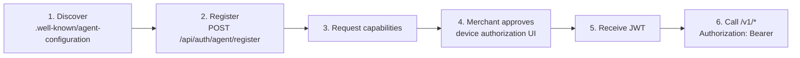
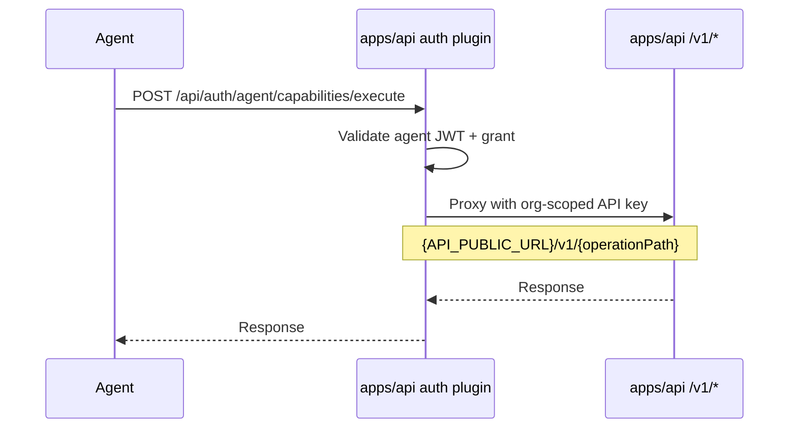

The Commerce API implements [Better Auth Agent Auth](https://www.better-auth.com/docs/plugins/agent-auth) on top of the same OpenAPI contract documented at [Commerce API](/docs/api).

AI agents can discover, register, request capabilities, and call commerce operations with delegated user authority.

## Discovery

Agents load the provider configuration from:

```
GET https://<api-host>/.well-known/agent-configuration
```

Response includes:

```json
{
  "issuer": "http://localhost:3005",
  "authorization_endpoint": "http://localhost:3005/api/auth/agent/authorize",
  "token_endpoint": "http://localhost:3005/api/auth/agent/token",
  "registration_endpoint": "http://localhost:3005/api/auth/agent/register",
  "capabilities_endpoint": "http://localhost:3005/api/auth/agent/capabilities"
}
```

Better Auth routes (registration, capability execute, device approval) are mounted at `/api/auth/*` on the API app (port **3005** in local dev).

## Capabilities from OpenAPI

Every REST operation with an `operationId` in the OpenAPI spec becomes an agent capability:

| Capability | Method | Scope required |
| --- | --- | --- |
| `listProducts` | GET | `storefront` (auto-grant) |
| `getProduct` | GET | `storefront` (auto-grant) |
| `addCartItem` | POST | `storefront` (requires approval) |
| `placeOrder` | POST | `storefront` (requires approval) |
| `adminCreateProduct` | POST | `admin` (requires approval) |
| `adminRefundOrder` | POST | `admin` (requires approval) |

Read-only methods (`GET`) can be auto-granted to new agent hosts. Mutating methods (`POST`, `PATCH`, `DELETE`) require user approval via device authorization or CIBA.

## Agent registration flow



## Calling the REST API directly

When an agent calls `/v1/*` with an `Authorization: Bearer` agent JWT:

1. API validates the JWT signature and expiry
2. Maps granted capabilities to `storefront` / `admin` scopes
3. Resolves tenant from the delegated user's organization membership (or `organizationId` in agent metadata)
4. Executes the operation scoped to that tenant

```bash
curl -H "Authorization: Bearer eyJ..." \
  http://localhost:3005/v1/products?limit=5
```

## OpenAPI proxy execution

When capabilities run through the default execute endpoint, the plugin proxies HTTP to the public API base URL:



### Required environment variables

| Variable | Purpose |
| --- | --- |
| `API_PUBLIC_URL` | Public API origin used in OpenAPI + proxy (defaults to `BETTER_AUTH_URL`) |
| `AGENT_PROXY_API_KEYS_BY_ORG` | JSON object mapping organization IDs to org-scoped API keys for proxied capability execution |
| `AGENT_DEVICE_AUTH_PAGE` | Path for the merchant approval UI (default `/device/capabilities`) |
| `TRUST_PROXY` | Set `true` behind a reverse proxy for JWT `aud` validation |

## Database tables

Run `pnpm --filter api db:push` after upgrading to create Agent Auth tables:

| Table | Purpose |
| --- | --- |
| `agentHost` | Registered agent host applications |
| `agent` | Individual agent instances |
| `agentCapabilityGrant` | Approved capabilities per agent |
| `approvalRequest` | Pending user approval requests |

## Security considerations

- Agents operate with **delegated user authority** — they can only access data the approving user can access
- Mutating capabilities require explicit user approval (device authorization flow)
- Agent JWTs are short-lived and scoped to granted capabilities
- Tenant isolation applies — agents cannot cross organization boundaries
- Proxied capability execution requires agent metadata with `organizationId` and a matching key in `AGENT_PROXY_API_KEYS_BY_ORG`

## Example: agent shopping assistant

An AI shopping assistant agent might request these capabilities:

| Capability | Purpose | Auto-grant? |
| --- | --- | --- |
| `listProducts` | Search catalog | Yes |
| `getProduct` | View product details | Yes |
| `createCart` | Start a cart | Yes |
| `addCartItem` | Add to cart | No — requires approval |
| `placeOrder` | Complete purchase | No — requires approval |

The merchant approves mutating capabilities via the device authorization page, ensuring the agent cannot place orders without explicit consent.

## Related pages

<Cards>
  <Card title="MCP server" href="/docs/apps/api/mcp" description="Alternative agent interface via MCP tools." />
  <Card title="Authentication" href="/docs/apps/api/authentication" description="How JWT callers are resolved." />
  <Card title="OpenAPI reference" href="/docs/api" description="Full API contract with operationIds." />
</Cards>
