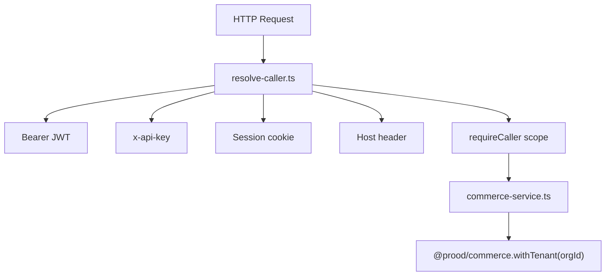

`apps/api` is the **central Commerce API server**. It is the only application that directly invokes `@prood/commerce` and `@prood/platform`. All other apps consume it via HTTP.

**Port:** 3005 · **Framework:** Next.js 16 · **OpenAPI:** `/v1/openapi.json`

## Responsibilities

| Surface | Path | Purpose |
| --- | --- | --- |
| REST API | `/v1/*` | Catalog, cart, orders, admin CRUD |
| OpenAPI | `/v1/openapi.json` | Machine-readable API contract |
| MCP server | `/mcp` | Model Context Protocol tools |
| Agent Auth | `/api/auth/*` | AI agent registration and capabilities |
| Discovery | `/.well-known/agent-configuration` | Agent Auth Protocol config |
| Webhooks | `/v1/webhooks/payments/{provider}` | Payment event ingress |

## Architecture



## Service layer

`lib/commerce-service.ts` wraps every `@prood/commerce` function with tenant scoping:

```ts
export async function listProducts(orgId: string, params: SearchParams) {
  return withTenant(orgId, () => getProducts(params))
}

export async function adminCreateProduct(orgId: string, input: CreateProductInput) {
  return withTenant(orgId, () => getAdmin().createProduct(input))
}
```

Route handlers are thin — they resolve the caller, validate input with Zod, call the service layer, and return JSON.

## Root endpoint

```
GET /
```

Returns API metadata:

```json
{
  "name": "Prood Commerce API",
  "version": "1.0.0",
  "adapter": "platform",
  "currency": "EUR",
  "links": {
    "openapi": "/v1/openapi.json",
    "health": "/v1/health",
    "mcp": "/mcp"
  }
}
```

## Configuration

| Variable | Purpose |
| --- | --- |
| `DATABASE_URL` | Commerce + auth database |
| `COMMERCE_CURRENCY` | Default currency |
| `BETTER_AUTH_SECRET`, `BETTER_AUTH_URL` | Auth (default `http://localhost:3005`) |
| `API_PUBLIC_URL` | Public origin for Agent Auth proxy |
| `AGENT_PROXY_API_KEY` | API key for proxied agent requests |
| `CHECKOUT_API_SECRET` | Webhook route protection |
| Payment/storage env vars | Provider instantiation |

## Related pages

<Cards>
  <Card title="Authentication" href="/docs/apps/api/authentication" description="Caller resolution and scope enforcement." />
  <Card title="Endpoints" href="/docs/apps/api/endpoints" description="Complete REST endpoint reference." />
  <Card title="MCP server" href="/docs/apps/api/mcp" description="Model Context Protocol tools." />
  <Card title="Agent Auth" href="/docs/apps/api/agent-auth" description="AI agent registration and capabilities." />
  <Card title="OpenAPI reference" href="/docs/api" description="Interactive API documentation." />
</Cards>
