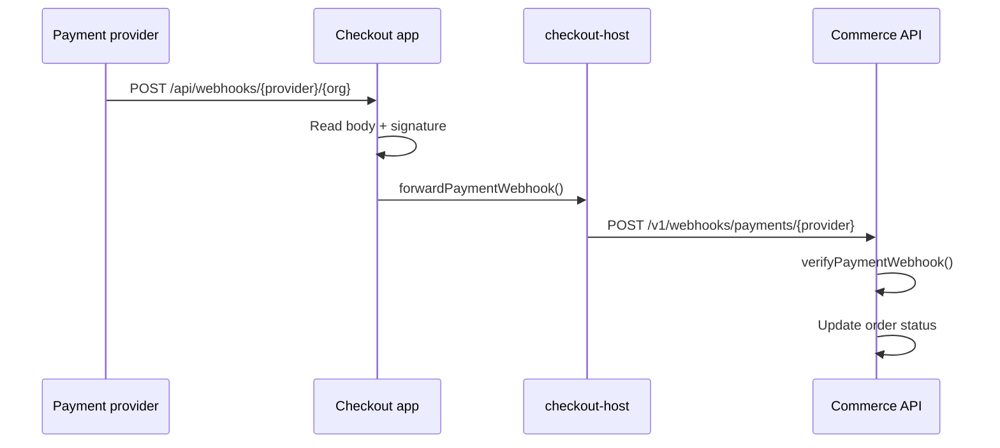

Payment providers send webhooks to notify about async payment events (Multibanco payments, 3DS completions, refunds). The checkout app receives these webhooks and forwards them to the Commerce API for order reconciliation.

## Webhook routes

```
POST /api/webhooks/{provider}/{org}
GET  /api/webhooks/{provider}/{org}  (provider verification)
```

| Segment | Values |
| --- | --- |
| `provider` | `stripe`, `easypay`, `ifthenpay` |
| `org` | Organization ID (tenant) or `_` for env-fallback |

### Example URLs

```
POST https://checkout.example.com/api/webhooks/stripe/org_abc123
POST https://checkout.example.com/api/webhooks/easypay/org_abc123
POST https://checkout.example.com/api/webhooks/ifthenpay/_
```

## Flow



## Per-tenant verification

Each tenant can configure their own webhook secret in the dashboard (Integrations page). The verification flow:

1. Load tenant's `integration_config` for the provider
2. Decrypt stored `webhookSecret`
3. Verify signature against tenant's secret
4. Fall back to env var (`STRIPE_WEBHOOK_SECRET`, etc.) if org is `_` or secret not configured

```ts
// @prood/commerce
export async function verifyPaymentWebhook(
  payload: string,
  signature: string,
  providerId: string,
  orgId: string,
): Promise<PaymentWebhookResult> {
  const config = await loadIntegrationConfig(orgId, providerId)
  const provider = getPaymentProvider(providerId, config)
  return provider.verifyWebhook({ payload, signature })
}
```

## Provider-specific setup

### Stripe

1. In Stripe Dashboard → Webhooks → Add endpoint
2. URL: `https://checkout.example.com/api/webhooks/stripe/{orgId}`
3. Events (11 total):
   - `checkout.session.completed`, `checkout.session.expired`, `checkout.session.async_payment_succeeded`, `checkout.session.async_payment_failed`
   - `payment_intent.succeeded`, `payment_intent.payment_failed`, `payment_intent.canceled`, `payment_intent.processing`, `payment_intent.amount_capturable_updated`
   - `charge.refunded`, `refund.created`
4. Copy signing secret → dashboard Integrations → Stripe → webhook secret

Or run `./scripts/stripe-webhook-setup.sh` to configure via CLI.

### Easypay

1. Configure webhook URL in Easypay merchant panel
2. URL: `https://checkout.example.com/api/webhooks/easypay/{orgId}`
3. Easypay sends payment status notifications

### Ifthenpay

1. Configure callback URL in Ifthenpay backoffice
2. URL: `https://checkout.example.com/api/webhooks/ifthenpay/{orgId}`
3. Anti-phishing key used for verification

## Webhook as safety net

Webhooks complement the sync-on-return flow:

| Scenario | Primary | Fallback |
| --- | --- | --- |
| Stripe card payment | `checkout.confirm()` on return | Webhook `checkout.session.completed` |
| Customer closes browser during 3DS | — | Webhook `checkout.session.completed` updates order |
| Stripe async payment (bank transfer) | — | Webhook `checkout.session.async_payment_succeeded` |
| Multibanco async payment | — | Webhook when customer pays at ATM |
| MB WAY push notification | — | Webhook on phone confirmation |

The checkout state machine's `handleWebhookUpdate()` can transition from any non-terminal state based on webhook data.

## API webhook endpoint

The Commerce API also exposes a direct webhook endpoint:

```
POST /v1/webhooks/payments/{provider}?org={orgId}
Header: x-checkout-secret: {CHECKOUT_API_SECRET}
```

This is the target of `forwardPaymentWebhook()`. It can also be called directly if webhooks are routed to the API domain instead of the checkout domain.

## Related pages

<Cards>
  <Card title="Webhook setup guide" href="/docs/guides/webhook-setup" description="Step-by-step webhook configuration." />
  <Card title="Checkout flow" href="/docs/architecture/checkout-flow" description="Sync-on-return vs webhook strategy." />
  <Card title="Payment integration" href="/docs/guides/payment-integration" description="Provider setup and credentials." />
</Cards>
