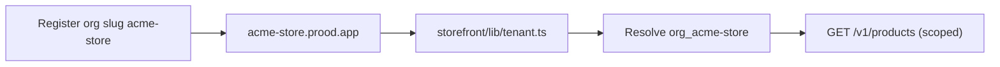

The dashboard **Domains** page lets merchants connect custom domains to their storefront. The storefront resolves the tenant from the request host, so each domain must be mapped to an organization.

## Domain types

| Type | Example | Setup |
| --- | --- | --- |
| **Platform subdomain** | `acme-store.prood.app` | Automatic — org slug + `NEXT_PUBLIC_PLATFORM_DOMAIN=prood.app` |
| **Store custom domain** | `shop.merchant.com` | Manual — add in dashboard, verify DNS, provision on storefront Vercel project |

Platform admin always lives at **`dashboard.prood.com`** (not on `prood.app`). A future **admin white-label domain** (e.g. `cms.my-brand.com` on Scale+) is documented in [Multi-tenant platform](/docs/architecture/multi-tenant) — not implemented yet.

## Subdomain (automatic)

When a merchant registers, their organization gets a slug (e.g. `acme-store`). The storefront is automatically available at `{slug}.{NEXT_PUBLIC_PLATFORM_DOMAIN}` — no dashboard action required.



Subdomain resolution happens in `apps/storefront/lib/tenant.ts`.

## Custom domain setup

**Route:** `/domains`

### Step 1 — Add domain

Merchant enters their custom domain (e.g. `shop.acme.com`). The dashboard:

1. Inserts a row in `tenant_domain` with `verified = false`
2. Calls Vercel SDK to add the domain to the storefront Vercel project
3. Returns DNS records the merchant must configure

### Step 2 — DNS verification

The merchant adds DNS records at their registrar:

| Type | Name | Value |
| --- | --- | --- |
| CNAME | `shop.acme.com` | `cname.vercel-dns.com` |
| TXT | `_prood-verify.shop.acme.com` | Verification token |

### Step 3 — Verify

The dashboard polls Vercel's domain verification API. When verified:

1. `tenant_domain.verified` set to `true`
2. Storefront begins resolving the org from this host
3. SSL certificate provisioned automatically by Vercel

## Vercel integration

`lib/vercel.ts` wraps the Vercel SDK:

```ts
import { Vercel } from '@vercel/sdk'

const vercel = new Vercel({ bearerToken: process.env.VERCEL_TOKEN })

export async function addDomain(domain: string) {
  return vercel.projects.addProjectDomain({
    idOrName: process.env.STOREFRONT_VERCEL_PROJECT_ID!,
    teamId: process.env.VERCEL_TEAM_ID,
    requestBody: { name: domain },
  })
}
```

Required env vars (optional in local dev):

| Variable | Purpose |
| --- | --- |
| `VERCEL_TOKEN` | Vercel API bearer token |
| `STOREFRONT_VERCEL_PROJECT_ID` | **Storefront** Vercel project ID (store custom domains attach here) |
| `VERCEL_TEAM_ID` | Vercel team ID (if applicable) |

## Storage schema

```sql
CREATE TABLE tenant_domain (
  id              TEXT PRIMARY KEY,
  organization_id TEXT NOT NULL,
  domain          TEXT NOT NULL UNIQUE,
  verified        BOOLEAN DEFAULT false,
  created_at      TIMESTAMPTZ,
  updated_at      TIMESTAMPTZ
);
```

## Server actions

`app/(dashboard)/domains/actions.ts`:

```ts
'use server'
export async function addDomain(domain: string) {
  return withActiveOrg(async (orgId) => {
    await createTenantDomain(orgId, domain)
    await vercelAddDomain(domain)
  })
}

export async function removeDomain(domainId: string) {
  return withActiveOrg(async (orgId) => {
    const domain = await getTenantDomain(domainId, orgId)
    await vercelRemoveDomain(domain.domain)
    await deleteTenantDomain(domainId, orgId)
  })
}
```

## Local development

Custom domains are not required for local dev:

1. Run `pnpm db:setup` and copy the seeded organization id into `DEFAULT_TENANT_ORG_ID`
2. Access [http://localhost:3000](http://localhost:3000)
3. For subdomain testing: `/etc/hosts` entry + `NEXT_PUBLIC_PLATFORM_DOMAIN`

Plan limits: Free includes **one** custom domain; enforcement runs in `addDomainAction`.

## Related pages

<Cards>
  <Card title="Storefront tenant resolution" href="/docs/apps/storefront/auth-tenant" description="How the storefront maps hosts to orgs." />
  <Card title="Multi-tenant platform" href="/docs/architecture/multi-tenant" description="Tenant isolation architecture." />
  <Card title="Merchant onboarding" href="/docs/guides/merchant-onboarding" description="Full new merchant setup guide." />
</Cards>
