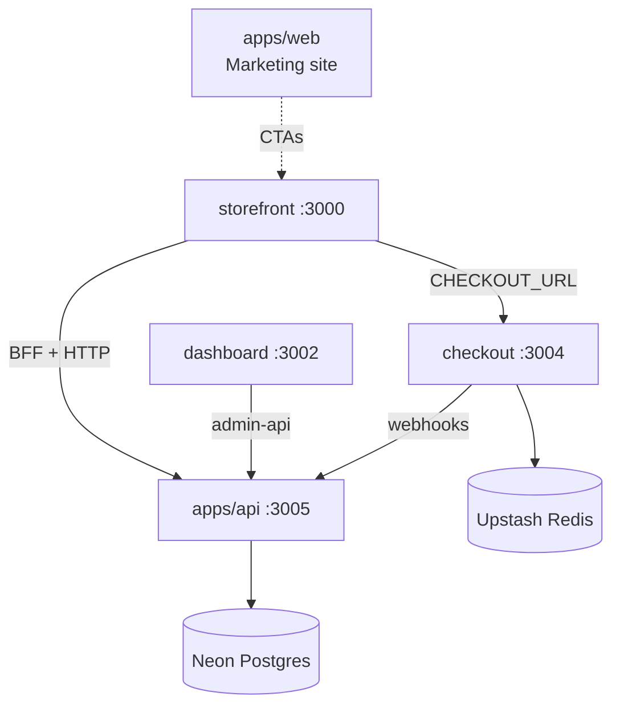

Prood ships five deployable Next.js applications, each with a distinct role in the commerce platform.

## Application map

| App | Port | Deploy target | Database | Primary packages |
| --- | --- | --- | --- | --- |
| **storefront** | 3000 | Vercel (per-tenant domains) | Auth + tenant lookup | `@prood/api-client`, `@prood/ui`, `@prood/types` |
| **dashboard** | 3002 | Vercel (single admin URL) | Auth + integrations + domains | `@prood/api-client`, `@prood/commerce`, `@prood/ui` |
| **checkout** | 3004 | Vercel (single checkout URL) | None (Redis only) | `@prood/checkout-host`, `@prood/ui` |
| **api** | 3005 | Vercel (API subdomain) | Full commerce + auth | `@prood/commerce`, `@prood/types` |
| **web** | 3001 | Vercel | None | `@prood/ui` |
| **docs** | 3003 | Vercel | None | Fumadocs |

## Interaction diagram

## Auth split

Auth issuance is centralized on **apps/api** for the dashboard; the storefront keeps a local handler on each store origin. All apps share the same Neon database:

| App | Users | Auth HTTP handler | Auth plugins |
| --- | --- | --- | --- |
| **Storefront** | Customers (buyers) | Local `/api/auth` on storefront origin | Email/password |
| **Dashboard** | Merchants (admins) | **Remote** — browser calls `apps/api` (`NEXT_PUBLIC_AUTH_URL`) | Email/password + **organization** |
| **API** | All caller types | `/api/auth` on API origin | organization + **apiKey** + **agentAuth** |

Customer accounts on the storefront are separate from merchant accounts on the dashboard. A person can be both, but they authenticate to different apps.

## Data access patterns

| App | Commerce data | How |
| --- | --- | --- |
| Storefront | Catalog, cart, orders | `@prood/api-client` → API (server components + BFF) |
| Dashboard | Products, orders, customers, stats | `@prood/api-client` → API `/v1/admin/*` |
| Dashboard | Integrations, domains | Direct `@prood/commerce` + Drizzle (not via API) |
| Checkout | Order status | Webhook forward → API |
| API | Everything | `@prood/commerce` → `@prood/platform` |

## Deployment model

In production, each app is a **separate Vercel project** sharing the same Neon database:

| Project | Custom domains | Notes |
| --- | --- | --- |
| Storefront | Per-merchant domains + subdomains | Tenant resolved from Host |
| Dashboard | Single admin URL (e.g. `admin.example.com`) | Org switching in session |
| Checkout | Single checkout URL (e.g. `checkout.example.com`) | Shared across all tenants |
| API | Single API URL (e.g. `api.example.com`) | All callers hit one origin |
| Docs | `docs.example.com` | Static + OpenAPI |

See [Deployment guide](/docs/guides/deployment) for the full checklist.

## Application guides

<Cards>
  <Card title="Storefront" href="/docs/apps/storefront" description="Customer-facing catalog, cart, checkout redirect, and account." />
  <Card title="Dashboard" href="/docs/apps/dashboard" description="Merchant admin — products, orders, integrations, domains." />
  <Card title="Checkout" href="/docs/apps/checkout" description="Hosted payment app with Redis sessions." />
  <Card title="Commerce API" href="/docs/apps/api" description="REST API, MCP, Agent Auth, and webhooks." />
</Cards>
