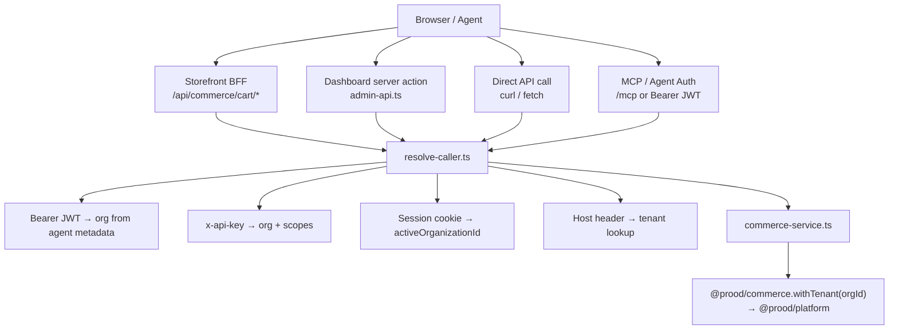
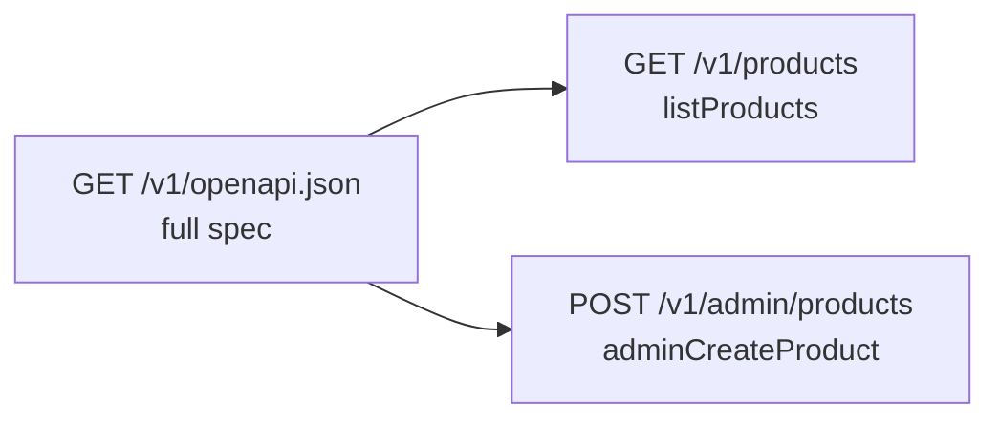

Prood uses an **API-centric architecture**: all commerce reads and writes go through `apps/api`, and client applications use `@prood/api-client`.

## Why an API layer?

| Concern | Direct import (`@prood/commerce`) | API-centric (`apps/api`) |
| --- | --- | --- |
| **Auth** | Each app implements tenant resolution | Single `resolveCaller()` with JWT, API key, session, Host |
| **Contract** | Implicit function signatures | OpenAPI 3.1 spec → typed client, MCP tools, Agent Auth |
| **Agents** | Not possible without custom wiring | Every `operationId` → agent capability |
| **Caching** | Per-app cache tag management | API controls cache invalidation via `revalidateTag` |
| **Deployment** | Apps need DB access | Only API needs `DATABASE_URL` for commerce |
| **Testing** | Mock `@prood/commerce` in each app | Mock HTTP or test API routes directly |

The storefront and dashboard are **thin clients**. They render UI and call HTTP endpoints. Business logic lives in `@prood/commerce`, invoked only by the API.

## Request flow



## When the storefront uses a BFF

Not every storefront request goes directly to the API. Local BFF routes exist where browser UX requires them:

| BFF route | Why not direct API? |
| --- | --- |
| `/api/commerce/cart/*` | Cart ID stored in HTTP-only cookie; BFF reads cookie and forwards to API |
| `/api/commerce/search` | Client-side search palette needs a lightweight JSON endpoint |
| `/api/commerce/countries` | Static-ish data for address forms; avoids exposing API URL to client |
| `/api/auth/[...all]` (storefront only) | Better Auth handler must run on the storefront origin (`*.prood.app` / custom domains) |

**Dashboard** does not host `/api/auth`. Merchant sign-in targets `apps/api` via `NEXT_PUBLIC_AUTH_URL`; session cookies are shared on `*.prood.com` through `AUTH_COOKIE_DOMAIN`.

Everything else (products, categories, store info, orders) is fetched **server-side** in React Server Components via `@prood/api-client`.

## API client configuration

Both storefront and dashboard create an API client that forwards authentication context:

```ts
// apps/storefront/lib/commerce-api.ts
import { createCommerceApiClient } from '@prood/api-client'

export function getCommerceApi() {
  return createCommerceApiClient({
    baseUrl: process.env.COMMERCE_API_URL!,
    headers: async () => {
      const h = await headers()
      return {
        cookie: h.get('cookie') ?? '',
        host: h.get('host') ?? '',
      }
    },
  })
}
```

The API uses the `Host` header for tenant resolution on storefront-scoped routes and the session cookie for dashboard admin routes.

## Scopes

The API enforces two scopes:

| Scope | Access |
| --- | --- |
| `storefront` | Catalog reads, cart CRUD, place order, customer orders |
| `admin` | Full CRUD — products, orders, customers, store settings, inventory, dashboard stats |

Route handlers call `requireCaller('storefront')` or `requireCaller('admin')` to enforce scope.

## OpenAPI as the contract

The API generates OpenAPI 3.1 from Zod schemas in `apps/api/lib/schemas.ts`:



The docs site syncs this spec at build time (`pnpm sync:openapi`) and renders it via **Fumadocs OpenAPI** at `/docs/api/*`.

`@prood/api-client` is generated from the same spec, ensuring type safety between server and client.

## MCP and Agent Auth

The API also exposes:

| Surface | Path | Purpose |
| --- | --- | --- |
| **MCP server** | `/mcp` | Model Context Protocol tools mirroring REST endpoints |
| **Agent Auth** | `/api/auth/*` + `/.well-known/agent-configuration` | AI agent registration, capability grants, JWT access |
| **API keys** | `x-api-key` header | Programmatic access with org + scope metadata |

See [Agent Auth](/docs/apps/api/agent-auth) and [MCP server](/docs/apps/api/mcp).

## Dashboard exception

The dashboard uses `@prood/commerce` directly for two operations that do not go through the REST API:

1. **Integration config** — encrypt/decrypt provider credentials in `integration_config`
2. **Domain management** — CRUD on `tenant_domain` table

All product, order, and customer management goes through `admin-api.ts` → API `/v1/admin/*`.

## Using commerce from apps

| Pattern | Recommended approach |
| --- | --- |
| `import { getProducts } from '@prood/commerce'` in an app | `getCommerceApi().GET('/products')` |
| Client-side composable for catalog data | Server component + `commerce-data.ts` fetchers |
| `createCommerce({ adapter })` | Only in `apps/api/lib/commerce-service.ts` |
| Custom commerce endpoints | Explicit routes in `apps/api/app/v1/` |

## Related pages

<Cards>
  <Card title="Commerce API" href="/docs/apps/api" description="REST endpoints, routes, and service layer." />
  <Card title="Authentication" href="/docs/apps/api/authentication" description="Caller resolution and scopes." />
  <Card title="@prood/api-client" href="/docs/packages/api-client" description="Typed HTTP client." />
  <Card title="OpenAPI reference" href="/docs/api" description="Interactive API documentation." />
</Cards>
