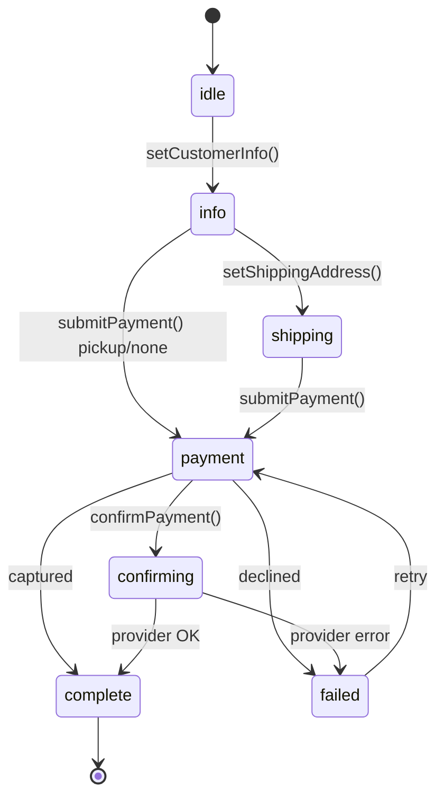
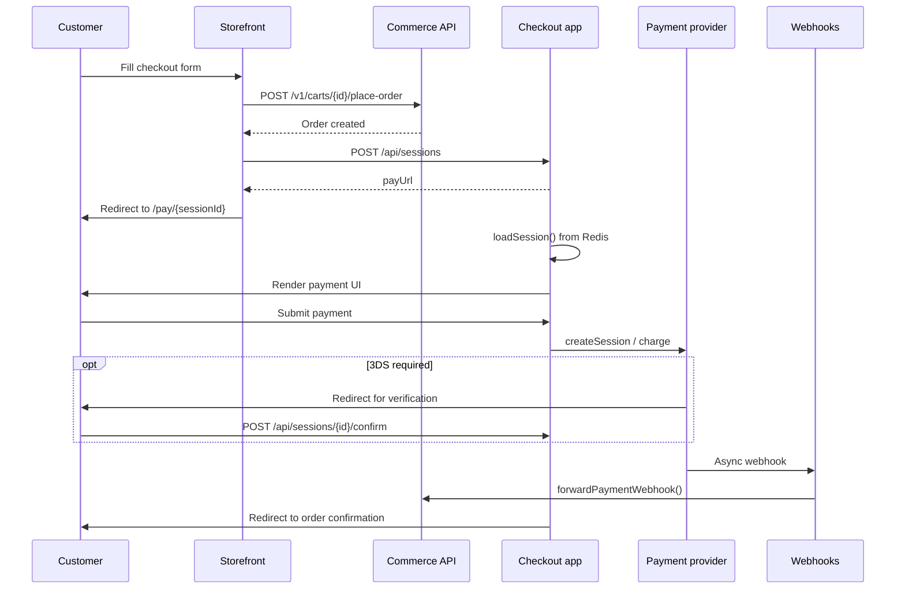

The `@prood/checkout` package provides a **framework-agnostic state machine** that orchestrates the complete checkout flow. It enforces valid transitions, emits events, and works identically in Node.js, Edge runtimes, and the browser.

In this monorepo, checkout sessions are hosted by `@prood/checkout-host` in `apps/checkout`, persisted in **Upstash Redis**.

## State machine



The checkout flow adapts dynamically based on the **fulfillment type** set during session creation:

| Fulfillment | Flow | Skips |
| --- | --- | --- |
| `shipping` | idle → info → **shipping** → payment → confirming → complete | — |
| `local_delivery` | idle → info → **shipping** → payment → confirming → complete | — |
| `pickup` | idle → info → payment → confirming → complete | address + shipping |
| `none` | idle → info → payment → confirming → complete | address + shipping |

### State transitions

| State | Allowed transitions | Triggered by |
| --- | --- | --- |
| `idle` | `info` | `setCustomerInfo()` |
| `info` | `shipping`, `payment` | `setShippingAddress()` or `submitPayment()` (pickup/none) |
| `shipping` | `payment` | `submitPayment()` |
| `payment` | `confirming`, `complete`, `failed` | `confirmPayment()`, webhook |
| `confirming` | `complete`, `failed` | Provider response |
| `failed` | `payment` | Retry with new payment method |
| `complete` | — | Terminal state |

Invalid transitions throw errors — the state machine prevents skipping steps.

## End-to-end flow in Prood



## Step-by-step API usage

### Create a session (programmatic)

```ts
import { CheckoutSession } from '@prood/checkout'
import { StripePaymentProvider } from '@prood/payment-stripe'

const provider = new StripePaymentProvider({
  secretKey: process.env.STRIPE_SECRET_KEY!,
})

const session = new CheckoutSession({
  provider,
  amount: 9999,        // minor units (cents)
  currency: 'EUR',
  orderId: 'ord_123',
  returnUrl: 'https://store.example.com/order-confirmation',
  fulfillment: 'shipping',
})
```

### Set customer info (idle → info)

```ts
session.setCustomerInfo({
  email: 'customer@example.com',
  firstName: 'Maria',
  lastName: 'Silva',
  phone: '+351912345678',
})
// session.state === 'info'
```

### Set shipping address (info → shipping)

Only required when fulfillment is `shipping` or `local_delivery`:

```ts
session.setShippingAddress({
  street: 'Rua Augusta 123',
  street2: null,
  city: 'Lisboa',
  state: null,
  country: 'PT',
  postalCode: '1100-053',
  district: null,
  nationalAddress: null,
})
// session.state === 'shipping'
```

For `pickup` or `none` fulfillment, call `submitPayment()` directly from `info`.

### Submit payment (shipping/info → payment)

```ts
const paymentSession = await session.submitPayment({
  sourceToken: 'pm_xxx',  // Stripe payment method ID
})

if (paymentSession.redirectUrl) {
  // Redirect customer to 3DS verification
}
// session.state === 'payment'
```

### Confirm payment (payment → confirming → complete)

After 3DS redirect or synchronous capture:

```ts
const confirmed = await session.confirmPayment(chargeId)
// session.state === 'complete' (if captured)
// session.state === 'failed' (if declined)
```

### Webhook safety net

For asynchronous results, `handleWebhookUpdate()` can transition from any non-terminal state:

```ts
session.handleWebhookUpdate({
  id: event.id,
  providerId: 'stripe',
  status: 'captured',
  amount: 9999,
  currency: 'EUR',
  redirectUrl: null,
  createdAt: new Date().toISOString(),
})
```

## Sync-on-return vs webhook

Prood uses a **dual strategy** for payment confirmation:

| Method | When | How |
| --- | --- | --- |
| **Sync-on-return** | Customer redirected back from 3DS | `confirmPayment()` calls provider to verify |
| **Webhook** | Async notification from provider | `handleWebhookUpdate()` or API webhook handler updates order |

The webhook acts as a safety net. If the customer closes their browser during 3DS, or the redirect fails, the webhook still updates the order status.

## Events

`CheckoutSession` extends `EventEmitter`:

```ts
session.on('stateChange', ({ from, to }) => {
  console.log(`Checkout: ${from} → ${to}`)
})

session.on('complete', ({ paymentSession }) => {
  // Send confirmation email, update order status
})

session.on('error', ({ error, state }) => {
  // Log error, show failure UI
})

session.on('expired', () => {
  // Session TTL exceeded
})
```

## Session expiry

Sessions can be configured with a TTL:

```ts
const session = new CheckoutSession({
  provider,
  amount: 4500,
  currency: 'EUR',
  channel: 'pos',
  expiresIn: 30 * 60 * 1000, // 30 minutes
})
```

Once expired, all state-mutating methods throw and the `expired` event fires. The `expiresAt` timestamp is included in the snapshot for client-side countdown display.

## Retry logic

Failed payments can be retried — the state machine allows `failed → payment`:

```ts
if (session.state === 'failed') {
  const retry = await session.submitPayment({
    sourceToken: 'pm_new_card',
  })
}
```

## Snapshots

`toSnapshot()` returns a serializable representation for SSR hydration, Redis persistence, or client display:

```ts
const snapshot = session.toSnapshot()
// {
//   state: 'payment',
//   channel: 'web',
//   fulfillment: 'shipping',
//   expiresAt: '2026-05-29T10:00:00.000Z',
//   customerInfo: { ... },
//   paymentSession: { id: 'pi_xxx', status: 'pending', ... },
//   amount: 9999,
//   currency: 'EUR',
//   error: null,
// }
```

`@prood/checkout-host` persists snapshots in Redis and rehydrates them on each request.

## Checkout URL strategy

Prood separates **where customers browse** from **where they pay**:

| Surface | Domain | Example |
| --- | --- | --- |
| Storefront | `{slug}.prood.app` or custom domain | `https://demo-store.prood.app` |
| Hosted checkout (Phase 1 — current) | `pay.prood.com` | `https://pay.prood.com/pay/cs_...` |
| Store-hosted checkout (Phase 2 — planned) | Same as storefront host | `https://demo-store.prood.app/pay/cs_...` |

### Phase 1 — shared checkout on prood.com

After the storefront places an order, it creates a session via `POST {CHECKOUT_URL}/api/sessions` and redirects the customer to:

```
https://pay.prood.com/pay/{sessionId}
```

- `CHECKOUT_URL=https://pay.prood.com` in production
- `tenantId` is resolved from the storefront host (not `DEFAULT_TENANT_ORG_ID`)
- `returnUrl` points back to the store host (e.g. `https://demo-store.prood.app/order-confirmation?orderId=...`)
- Webhooks: `https://pay.prood.com/api/webhooks/{provider}/{orgId}`

This is the simplest multi-tenant setup: one checkout deployment, tenant context on the session.

### Phase 2 — Shopify-like checkout on the store host (planned)

For stronger brand trust, payment URLs can move to the merchant's storefront host:

```
https://demo-store.prood.app/pay/{sessionId}
```

Implementation options: reverse-proxy `/pay/*` to the checkout app, or mount pay routes on the storefront. Requires passing `checkoutBaseUrl` from the storefront when creating the session instead of a global `CHECKOUT_URL` prefix.

## Related pages

<Cards>
  <Card title="Checkout app" href="/docs/apps/checkout" description="Hosted payment app — sessions, routes, and Redis." />
  <Card title="Payment integration" href="/docs/guides/payment-integration" description="Configure Stripe, Easypay, and Ifthenpay." />
  <Card title="@prood/checkout package" href="/docs/packages/checkout" description="State machine API reference." />
</Cards>
