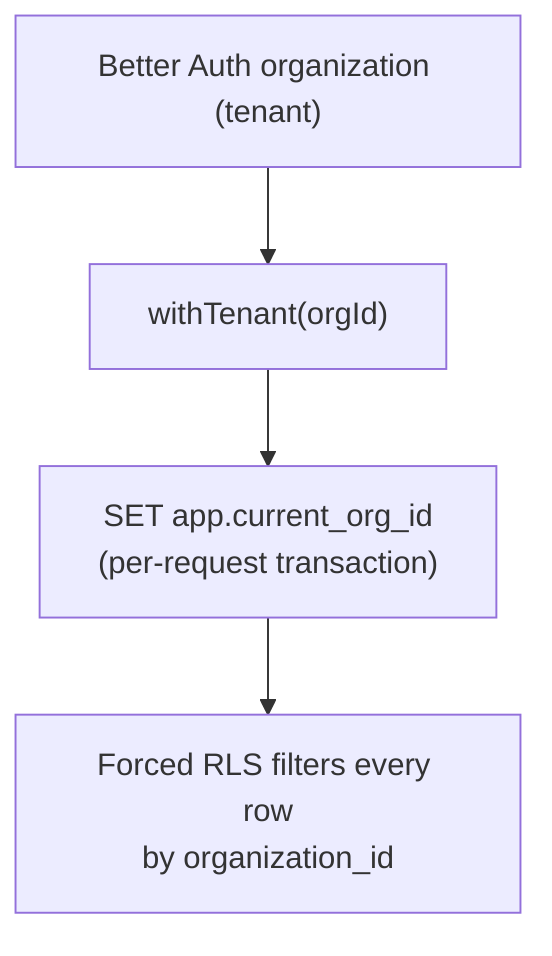

Prood runs as a **white-label, multi-tenant commerce platform**: one deployment serves many merchant stores. Each store is a Better Auth **organization**, and all commerce data is isolated per organization by **Postgres row-level security (RLS)**.

## Domain architecture

| URL | App | Tenant resolution |
| --- | --- | --- |
| `prood.com` | Marketing | N/A |
| `dashboard.prood.com` | Merchant admin | Session `activeOrganizationId` |
| `api.prood.com` | Commerce API | Session / API key / forwarded store `Host` |
| `pay.prood.com` | Hosted checkout | `tenantId` on checkout session |
| `{slug}.prood.app` | Storefront | Host → org slug or custom domain |
| `shop.client.com` | Storefront | Verified `tenant_domain` row |

`NEXT_PUBLIC_PLATFORM_DOMAIN=prood.app` applies **only** to merchant storefront subdomains (`{slug}.prood.app`), not to platform services on `prood.com`.

## Tenant model



| Surface | Tenant source | Mechanism |
| --- | --- | --- |
| **Dashboard** | `session.activeOrganizationId` | `withActiveOrg()` → `withTenant()` |
| **Storefront** | Request `Host` header | `resolveTenantId()` → API calls with tenant context |
| **API** | Caller resolution | JWT / API key / session / Host → `orgId` |
| **Checkout** | Session metadata | `tenantId` stored on checkout session at creation |

## Storefront host resolution

The storefront resolves the active tenant in `apps/storefront/lib/tenant.ts`:

1. **Custom domain** — lookup verified row in `tenant_domain` table
2. **Subdomain** — `{slug}.{NEXT_PUBLIC_PLATFORM_DOMAIN}` → `organization.slug`
3. **Fallback** — `DEFAULT_TENANT_ORG_ID` (seeded demo store `org_demo`)

In **production**, an unmatched host returns `notFound()`. In **development**, the fallback serves the demo store so local work does not require DNS setup.

### Per-tenant caching

Catalog reads are cached **per tenant** with tags like `products-{orgId}`, `categories-{orgId}`, `store-{orgId}`. Cache never crosses tenant boundaries.

## Row-level security

`applyTenantIsolation()` (in `packages/platform/src/database/drizzle/migrate.ts`):

1. Adds `organization_id` column to every tenant table (defaulting to `current_setting('app.current_org_id')`)
2. Enables and **forces** RLS with a `tenant_isolation` policy on each table

Every commerce query must run inside `withTenant(orgId)`, which sets the Postgres session variable within a transaction:

```ts
// packages/platform
export async function withTenant<T>(orgId: string, fn: () => Promise<T>): Promise<T> {
  return getDb().transaction(async (tx) => {
    await tx.execute(sql`SELECT set_config('app.current_org_id', ${orgId}, true)`)
    return fn()
  })
}
```

### Verifying isolation

Test against a real database with two organizations:

```sql
-- Set tenant A
SELECT set_config('app.current_org_id', '<org A id>', false);
SELECT id, name, organization_id FROM products;   -- only A's rows

-- Switch to tenant B
SELECT set_config('app.current_org_id', '<org B id>', false);
SELECT id, name, organization_id FROM products;   -- only B's rows

-- No setting → zero rows (writes blocked too)
RESET app.current_org_id;
SELECT id, name FROM products;   -- empty
```

## Onboarding a new merchant

1. **Register** in the dashboard → creates a user + first organization (the store)
2. The org ID becomes the tenant key for all commerce data
3. **Add a domain** in Dashboard → Domains (subdomain is automatic; custom domains use Vercel SDK + DNS verification)
4. The storefront at that host resolves to the org and shows the merchant's catalog

See [Merchant onboarding guide](/docs/guides/merchant-onboarding) for the full walkthrough.

## Per-tenant integrations

Payment credentials configured in the dashboard (`integration_config` table) flow into the provider factory at runtime:

| Step | What happens |
| --- | --- |
| Dashboard save | Credentials encrypted with AES-256-GCM (`encryptConfig`) and stored per org |
| Storefront checkout | Sends `tenantId` when creating a checkout session |
| Checkout pay | Rebuilds payment provider with tenant's decrypted credentials |
| Webhooks | Routed per tenant at `/api/webhooks/{provider}/{orgId}` |

Provider registry field keys in `apps/dashboard/lib/providers.ts` match provider constructor params, so stored config maps directly.

### Encryption at rest

`integration_config.config` values are encrypted using `INTEGRATION_ENCRYPTION_KEY` (falls back to `BETTER_AUTH_SECRET`). Values without the `enc:v1:` prefix are treated as plaintext (dev / migration).

## Storage namespacing

File uploads use tenant-prefixed keys:

```ts
uploadForTenant(orgId, input)       // key: org/<orgId>/...
tenantStorageDirectory(orgId, ...)  // directory prefix
```

Merchants cannot collide with or read each other's assets. Vercel Blob uploads use `addRandomSuffix` for unguessable URLs.

## Package security posture

| Package | Touches tenant data? | Isolation |
| --- | --- | --- |
| `platform` | Yes — owns schema | Forced RLS + `withTenant()` |
| `commerce` | Yes — wraps platform | Tenant threaded; per-tenant cache tags |
| `checkout-host` | Yes — sessions | `tenantId` on session; provider rebuilt per tenant |
| `checkout` | Per-session state | New instance per session; no module-level mutable state |
| `payment-*` | Credentials only | Stateless; config injected per tenant |
| `storage-*` | File uploads | Tenant-namespaced keys |
| `types`, `ui`, configs | No | Safe |

## Environment variables

| Variable | Purpose |
| --- | --- |
| `DEFAULT_TENANT_ORG_ID` | Explicit fallback tenant (single-tenant / dev) |
| `NEXT_PUBLIC_PLATFORM_DOMAIN` | Apex for `{slug}.prood.app` **storefront** subdomains only — not platform hosts on `prood.com` |
| `INTEGRATION_ENCRYPTION_KEY` | Encrypt stored provider credentials |
| `VERCEL_TOKEN`, `VERCEL_PROJECT_ID`, `VERCEL_TEAM_ID` | Custom domain provisioning (optional in dev) |

## Adding new tenant tables

When adding a new tenant-owned table:

1. Add it to `TENANT_TABLES` in `packages/platform/src/database/drizzle/migrate.ts`
2. If the natural key repeats across tenants, include `organization_id` in the primary key (see `store_info` and `integrations`)
3. Re-run migrations and verify RLS policies apply

## Custom domains (two products)

Merchants can have **two different kinds** of custom domain:

| Type | Default | Custom (paid tiers vary) | Routes to | Purpose |
| --- | --- | --- | --- | --- |
| **Store domain** | `{slug}.prood.app` | e.g. `shop.my-brand.com` | Storefront | Customer-facing catalog and cart |
| **Admin domain (white-label)** | `dashboard.prood.com` | e.g. `cms.my-brand.com` | Dashboard | Team-facing admin (DatoCMS-style) |

### Store custom domain (partially implemented)

- Configured in Dashboard → **Domains**
- Stored in `tenant_domain`, verified via DNS
- Attached to the **storefront** Vercel project (`VERCEL_PROJECT_ID`)
- Free plan includes one verified store custom domain (`maxCustomDomains` in billing)

### Admin white-label domain (Phase 3 — not implemented)

Similar to DatoCMS `dashboard.datocms.com` vs `cms.your-brand.com`:

- Default admin URL for all merchants: **`dashboard.prood.com`**
- Scale / Agency (planned): optional **`cms.my-brand.com`** with DNS verification
- Routes to `apps/dashboard`, not the storefront
- Requires a separate Vercel project attachment, dashboard host → org lookup, and Better Auth trusted origins per custom admin host
- Planned billing gate: `customAdminDomain` entitlement on Scale and Agency only

Store and admin custom domains are **independent** — a merchant might use `shop.acme.com` for customers and `cms.acme.com` for their team.

## Related pages

<Cards>
  <Card title="Dashboard domains" href="/docs/apps/dashboard/domains" description="Custom domain setup and Vercel integration." />
  <Card title="Dashboard integrations" href="/docs/apps/dashboard/integrations" description="Per-tenant payment and service credentials." />
  <Card title="API authentication" href="/docs/apps/api/authentication" description="How the API resolves tenant from callers." />
  <Card title="Merchant onboarding" href="/docs/guides/merchant-onboarding" description="Step-by-step new merchant setup." />
</Cards>
