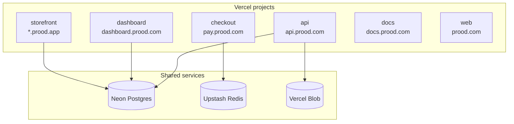

Prood deploys as **separate Vercel projects** sharing a single Neon Postgres database. Each app has its own environment variables and build configuration.

## Production URL map (Prood)

| URL | App |
| --- | --- |
| `prood.com` | Marketing (`apps/web`) |
| `dashboard.prood.com` | Merchant admin |
| `api.prood.com` | Commerce API |
| `pay.prood.com` | Hosted checkout |
| `docs.prood.com` | Documentation |
| `{slug}.prood.app` | Storefront (wildcard on storefront project) |
| `shop.client.com` | Store custom domain (per merchant) |

Set `NEXT_PUBLIC_PLATFORM_DOMAIN=prood.app` for storefront subdomain resolution only. Platform services use `*.prood.com` via each app's `BETTER_AUTH_URL` and public URL env vars.

## Deployment architecture



## Prerequisites

1. Vercel account with team/project access
2. Neon Postgres provisioned (Vercel marketplace integration)
3. Upstash Redis provisioned (Vercel marketplace integration)
4. Payment provider accounts (Stripe, Easypay, and/or Ifthenpay)
5. Domain names configured

## Step 1 — Database setup

Run migrations against the production database once:

```bash
# Set DATABASE_URL to production Neon connection string
DATABASE_URL="postgresql://..." pnpm db:setup
```

This creates commerce schema + RLS + seed data, and pushes auth tables.

## Step 2 — Deploy the API

The API must be deployed first — other apps depend on it.

| Setting | Value |
| --- | --- |
| Framework | Next.js |
| Root directory | `apps/api` |
| Build command | `cd ../.. && pnpm build --filter=api` |
| Node.js version | 24 |

### Environment variables

```bash
DATABASE_URL=postgresql://...
BETTER_AUTH_SECRET=<openssl rand -base64 32>
BETTER_AUTH_URL=https://api.prood.com
API_PUBLIC_URL=https://api.prood.com
COMMERCE_ADAPTER=platform
COMMERCE_CURRENCY=EUR
DEFAULT_PAYMENT_PROVIDER=stripe
STORAGE_PROVIDER=vercel-blob
BLOB_READ_WRITE_TOKEN=...
STRIPE_SECRET_KEY=sk_live_...
STRIPE_WEBHOOK_SECRET=whsec_...
CHECKOUT_API_SECRET=<shared secret>
INTEGRATION_ENCRYPTION_KEY=<openssl rand -base64 32>
NEXT_PUBLIC_PLATFORM_DOMAIN=prood.app
```

## Step 3 — Deploy the storefront

| Setting | Value |
| --- | --- |
| Root directory | `apps/storefront` |
| Build command | `cd ../.. && pnpm build --filter=storefront` |

### Environment variables

```bash
DATABASE_URL=postgresql://...
COMMERCE_API_URL=https://api.prood.com/v1
BETTER_AUTH_SECRET=<same as API>
BETTER_AUTH_URL=https://storefront.example.com
CHECKOUT_URL=https://pay.prood.com
CHECKOUT_API_SECRET=<same as API>
DEFAULT_TENANT_ORG_ID=          # leave empty for multi-tenant
NEXT_PUBLIC_PLATFORM_DOMAIN=prood.app
```

Custom domains are added per-merchant via the dashboard Domains page.

## Step 4 — Deploy the checkout app

| Setting | Value |
| --- | --- |
| Root directory | `apps/checkout` |
| Build command | `cd ../.. && pnpm build --filter=checkout` |

### Environment variables

```bash
UPSTASH_REDIS_REST_URL=https://...
UPSTASH_REDIS_REST_TOKEN=...
CHECKOUT_API_SECRET=<same as API>
CHECKOUT_URL=https://pay.prood.com
COMMERCE_API_URL=https://api.prood.com/v1
STOREFRONT_URL=https://storefront.example.com
NEXT_PUBLIC_STRIPE_PUBLISHABLE_KEY=pk_live_...
STRIPE_SECRET_KEY=sk_live_...
# Payment provider keys as fallbacks
```

Configure payment webhooks to: `https://pay.prood.com/api/webhooks/{provider}/{orgId}`

## Step 5 — Deploy the dashboard

| Setting | Value |
| --- | --- |
| Root directory | `apps/dashboard` |
| Build command | `cd ../.. && pnpm build --filter=dashboard` |

### Environment variables

```bash
DATABASE_URL=postgresql://...
COMMERCE_API_URL=https://api.prood.com/v1
BETTER_AUTH_SECRET=<same as API>
BETTER_AUTH_URL=https://dashboard.prood.com
INTEGRATION_ENCRYPTION_KEY=<same as API>
VERCEL_TOKEN=<for domain provisioning>
VERCEL_PROJECT_ID=<storefront project ID>
VERCEL_TEAM_ID=<team ID>
NEXT_PUBLIC_PLATFORM_DOMAIN=prood.app
```

## Step 6 — Deploy docs and web

| App | Root directory | Notes |
| --- | --- | --- |
| `docs` | `apps/docs` | Runs `sync:openapi` at build time |
| `web` | `apps/web` | Static marketing site |

```bash
# Docs
NEXT_PUBLIC_DOCS_URL=https://docs.prood.com

# Web
NEXT_PUBLIC_WEB_URL=https://prood.com
NEXT_PUBLIC_DOCS_URL=https://docs.prood.com
NEXT_PUBLIC_DASHBOARD_URL=https://dashboard.prood.com
NEXT_PUBLIC_API_URL=https://api.prood.com
NEXT_PUBLIC_STOREFRONT_URL=https://demo-store.prood.app
```

## Shared secrets

These must be **identical** across projects:

| Secret | Apps |
| --- | --- |
| `BETTER_AUTH_SECRET` | API, storefront, dashboard |
| `CHECKOUT_API_SECRET` | API, storefront, checkout |
| `INTEGRATION_ENCRYPTION_KEY` | API, dashboard |
| `DATABASE_URL` | API, storefront, dashboard |

## Caching in production

The storefront uses Next.js Cache Components:

- Catalog pages: `'use cache'` with per-tenant tags
- Cart/checkout/account: dynamic (cookie/session dependent)
- Cache invalidation: dashboard product updates trigger `revalidateTag` via API

## Production checklist

- [ ] Strong secrets generated for `BETTER_AUTH_SECRET`, `CHECKOUT_API_SECRET`, `INTEGRATION_ENCRYPTION_KEY`
- [ ] `DEFAULT_TENANT_ORG_ID` unset (multi-tenant) or set (single-tenant)
- [ ] `NEXT_PUBLIC_PLATFORM_DOMAIN` configured
- [ ] Upstash Redis provisioned for checkout
- [ ] Payment webhooks pointed to checkout domain
- [ ] `pnpm db:setup` run against production database
- [ ] Custom domains verified for at least one merchant
- [ ] SSL certificates active on all domains

## Related pages

<Cards>
  <Card title="Environment variables" href="/docs/getting-started/environment" description="Complete env var reference." />
  <Card title="Webhook setup" href="/docs/guides/webhook-setup" description="Configure payment webhooks." />
  <Card title="Payment integration" href="/docs/guides/payment-integration" description="Payment provider setup." />
</Cards>
