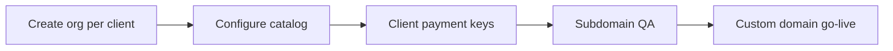

Agencies use Prood to **launch many client stores** without rebuilding checkout, tenant isolation, or admin panels for each engagement.

## Why agencies choose Prood

- **One store per client** — Each client is a separate Better Auth organization with Postgres row-level security.
- **Instant staging URL** — `{client-slug}.prood.app` is available as soon as the org is created.
- **Client-owned payments** — Stripe (or regional providers) are configured per store, not shared across clients.
- **Custom domains** — Each store can use its own domain (included on Free for one domain per store; more on Grow+).
- **Team per store** — Invite client stakeholders without sharing your agency login.

## Recommended workflow

1. **Create a new store** — Register or use a dedicated flow per client; note the organization slug for the subdomain.
2. **Build the catalog** — Products, categories, and media via the dashboard or API.
3. **Payments** — Enter the **client's** provider credentials under Integrations (encrypted per org).
4. **QA on subdomain** — Share `{slug}.prood.app` for UAT before DNS cutover.
5. **Production domain** — Add custom domain in [Domains](/docs/apps/dashboard/domains); client adds CNAME at their registrar.
6. **Handoff** — Invite client admins on [Team](/docs/apps/dashboard/team).

## Agency plan (marketing)

The [Agency pricing tier](https://prood.com/pricing) is intended for **10+ stores**, unlimited products/orders per store, unlimited custom domains, and dedicated support. Contact hello@prood.com for portfolio pricing before dashboard billing is available.

## Automation for power users

On **Grow** plans and above (when billing launches), each store can use:

- [REST API](/docs/api) and [MCP](/docs/apps/api/mcp) for catalog and order automation
- [Agent Auth](/docs/apps/api/agent-auth) for approved AI assistants

Useful for bulk imports, reporting pipelines, or client-specific workflows—always scoped to one organization at a time.

## Related

<Cards>
  <Card title="Multi-tenant platform" href="/docs/architecture/multi-tenant" description="How tenant isolation works." />
  <Card title="Merchant onboarding" href="/docs/guides/merchant-onboarding" description="Per-store setup checklist." />
  <Card title="Deployment" href="/docs/guides/deployment" description="Production hosting for all apps." />
</Cards>
