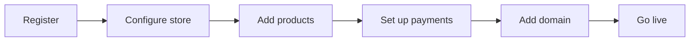
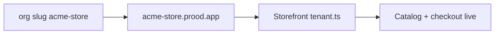

This guide walks through onboarding a new merchant from registration to a live storefront with custom domain and payment processing.

## Overview



Estimated time: 30–60 minutes (excluding DNS propagation).

## Step 1 — Register

1. Navigate to the dashboard: `https://dashboard.prood.com/register` (or your `NEXT_PUBLIC_DASHBOARD_URL` in dev)
2. Enter email, password, and store name
3. Better Auth creates:
   - A `user` record
   - An `organization` record (the store — e.g. slug `acme-store`)
   - A `member` record (user as `owner`)

The organization ID (e.g. `org_abc123`) becomes the **tenant key** for all commerce data.

## Step 2 — Configure store settings

1. Go to **Settings** (`/settings`)
2. Set store name, default currency, and contact information
3. These values appear on the storefront via `GET /v1/store`

## Step 3 — Add products

1. Go to **Products** → **New product** (`/products/new`)
2. Fill in:
   - Name and description (localized if multi-language)
   - Slug (URL path)
   - At least one variant with SKU, price, and inventory
   - Product images (uploaded via storage provider)
   - Categories
3. Set status to **Published**
4. Repeat for additional products

Verify products appear in the API:

```bash
curl -H "Host: acme-store.prood.app" \
  https://api.prood.com/v1/products
```

## Step 4 — Configure payments

1. Go to **Integrations** (`/integrations`)
2. Select your payment provider (Stripe recommended for global, Easypay/Ifthenpay for Portugal)
3. Enter provider credentials:

### Stripe

| Field | Where to find |
| --- | --- |
| Secret key | Stripe Dashboard → Developers → API keys |
| Publishable key | Same page |
| Webhook secret | Stripe Dashboard → Webhooks → Signing secret |

### Easypay

| Field | Where to find |
| --- | --- |
| Account ID | Easypay merchant panel |
| API key | Easypay merchant panel |

4. Save — credentials are encrypted and stored per organization

## Step 5 — Set up webhooks

Configure the payment provider to send webhooks to:

```
https://pay.prood.com/api/webhooks/{provider}/{orgId}
```

See [Webhook setup](/docs/guides/webhook-setup) for provider-specific instructions.

## Step 6 — Add domain

### Subdomain (automatic)

The store is immediately available on the platform subdomain — no dashboard action required:



### Custom domain

1. Go to **Domains** (`/domains`)
2. Enter custom domain: `shop.acme.com`
3. Add DNS records at your registrar:

| Type | Name | Value |
| --- | --- | --- |
| CNAME | `shop.acme.com` | `cname.vercel-dns.com` |

4. Wait for DNS propagation (up to 48 hours, usually minutes)
5. Dashboard shows verification status
6. Once verified, storefront serves at `https://shop.acme.com`

Requires Vercel domain provisioning env vars (`VERCEL_TOKEN`, `VERCEL_PROJECT_ID`).

## Step 7 — Invite team members

1. Go to **Team** (`/team`)
2. Invite colleagues by email with appropriate role:
   - **Admin** — full store management
   - **Member** — read-only (future fine-grained permissions)

## Step 8 — Test the full flow

1. Visit the storefront (subdomain or custom domain)
2. Browse products — verify catalog loads
3. Add item to cart
4. Proceed to checkout
5. Complete payment with test credentials
6. Verify order appears in dashboard **Orders**
7. Test refund flow (optional)

### Test checklist

- [ ] Storefront loads with correct store name and products
- [ ] Cart add/update/remove works
- [ ] Checkout form collects address and contact info
- [ ] Payment completes (Stripe test card or Easypay sandbox)
- [ ] Order appears in dashboard with correct status
- [ ] Webhook updates order from `pending` to `confirmed`
- [ ] Custom domain resolves (if configured)
- [ ] Team member can sign in and access dashboard

## Step 9 — Go live

1. Switch payment provider from test/sandbox to production keys
2. Update webhook URLs to production endpoints
3. Remove `DEFAULT_TENANT_ORG_ID` if set (ensures strict host resolution)
4. Verify SSL certificates are active on all domains
5. Monitor first real orders in dashboard

## Data isolation verification

After onboarding, verify the new merchant's data is isolated:

```sql
-- Connect to Neon Postgres
SELECT set_config('app.current_org_id', 'org_new_merchant', false);
SELECT count(*) FROM products;  -- only their products

SELECT set_config('app.current_org_id', 'org_demo', false);
SELECT count(*) FROM products;  -- only demo products
```

## Related pages

<Cards>
  <Card title="Multi-tenant platform" href="/docs/architecture/multi-tenant" description="Tenant isolation architecture." />
  <Card title="Dashboard domains" href="/docs/apps/dashboard/domains" description="Custom domain setup." />
  <Card title="Payment integration" href="/docs/guides/payment-integration" description="Payment provider configuration." />
  <Card title="Deployment" href="/docs/guides/deployment" description="Production deployment guide." />
</Cards>
