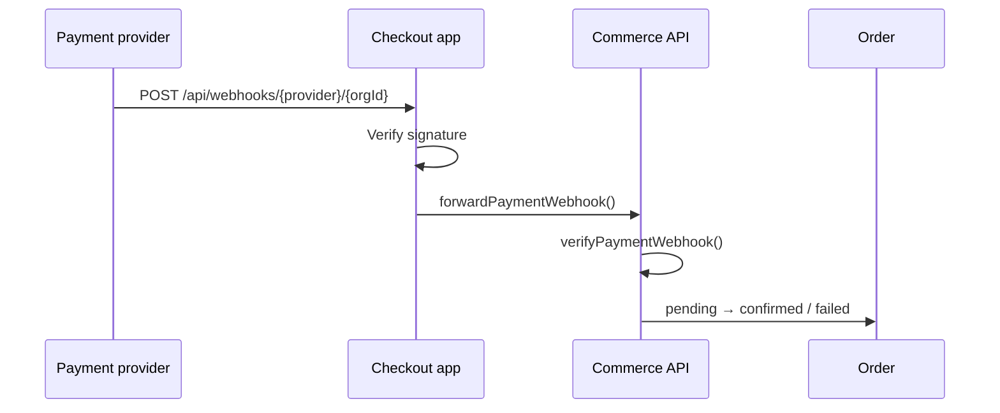
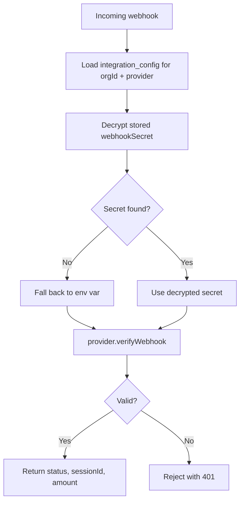

Payment webhooks are essential for async payment methods (Multibanco, MB WAY) and as a safety net for card payments (3DS failures, browser closes). This guide covers webhook configuration for all supported providers.

## Webhook architecture



## Why webhooks matter

| Scenario | Without webhook | With webhook |
| --- | --- | --- |
| Customer closes browser during 3DS | Order stuck as `pending` | Webhook confirms payment |
| Multibanco payment (async) | No way to detect payment | Webhook fires when customer pays at ATM |
| MB WAY timeout | Order stuck | Webhook on phone confirmation |
| Network error on confirm | Order stuck | Webhook as safety net |

## Stripe webhooks

### 1. Create webhook endpoint

In Stripe Dashboard → Developers → Webhooks → Add endpoint:

```
Endpoint URL: https://checkout.example.com/api/webhooks/stripe/{orgId}
```

Replace `{orgId}` with the merchant's organization ID (e.g. `org_demo`).

### 2. Select events

**Checkout Session events** (primary — required for Checkout Sessions API):

| Event | Purpose |
| --- | --- |
| `checkout.session.completed` | Payment captured (primary success signal) |
| `checkout.session.expired` | Session timed out before payment |
| `checkout.session.async_payment_succeeded` | Delayed payment confirmed (bank transfers, Boleto, etc.) |
| `checkout.session.async_payment_failed` | Delayed payment failed |

**PaymentIntent events** (Stripe fires these alongside Checkout Session events):

| Event | Purpose |
| --- | --- |
| `payment_intent.succeeded` | Payment captured |
| `payment_intent.payment_failed` | Payment declined |
| `payment_intent.canceled` | Payment canceled |
| `payment_intent.processing` | Payment processing |
| `payment_intent.amount_capturable_updated` | Funds available for manual capture |

**Charge / Refund events:**

| Event | Purpose |
| --- | --- |
| `charge.refunded` | Refund processed |
| `refund.created` | Refund initiated |

You can configure all events at once using the provided setup script:

```bash
./scripts/stripe-webhook-setup.sh
```

### 3. Copy signing secret

After creating the endpoint, copy the **Signing secret** (`whsec_...`).

### 4. Configure in dashboard

Dashboard → Integrations → Stripe → Webhook secret: `whsec_...`

Or set globally: `STRIPE_WEBHOOK_SECRET=whsec_...`

### 5. Test locally

Use Stripe CLI for local webhook testing:

```bash
stripe listen --forward-to localhost:3004/api/webhooks/stripe/org_demo
stripe trigger checkout.session.completed
stripe trigger payment_intent.succeeded
```

## Easypay webhooks

### 1. Configure in Easypay panel

Log in to Easypay merchant panel → Settings → Notifications:

```
Notification URL: https://checkout.example.com/api/webhooks/easypay/{orgId}
```

### 2. Events

Easypay sends notifications for:

- Payment received (Multibanco, MB WAY, card)
- Payment expired
- Refund processed

### 3. Sandbox testing

Use `EASYPAY_BASE_URL=https://api.test.easypay.pt` and configure test webhook URL similarly.

## Ifthenpay webhooks

### 1. Configure in backoffice

Log in to Ifthenpay backoffice → Configurações → Callback URL:

```
Callback URL: https://checkout.example.com/api/webhooks/ifthenpay/{orgId}
```

### 2. Anti-phishing verification

Ifthenpay includes an anti-phishing key in webhook payloads. The provider verifies this against `IFTHENPAY_ANTIPHISHING_KEY` (or tenant config).

## Per-tenant webhook URLs

Each merchant gets their own webhook URL with their org ID:

```
https://checkout.example.com/api/webhooks/stripe/org_merchant_a
https://checkout.example.com/api/webhooks/stripe/org_merchant_b
https://checkout.example.com/api/webhooks/easypay/org_merchant_a
```

This ensures webhook verification uses the correct tenant's stored secret.

For platform-wide (env-only) webhooks, use `_` as the org:

```
https://checkout.example.com/api/webhooks/stripe/_
```

## Webhook verification flow



## Direct API webhooks

Alternatively, route webhooks directly to the API (bypassing checkout):

```
POST https://api.example.com/v1/webhooks/payments/stripe?org={orgId}
Header: x-checkout-secret: {CHECKOUT_API_SECRET}
```

This is useful if you prefer a single webhook ingress point.

## Troubleshooting

| Issue | Check |
| --- | --- |
| 401 on webhook | `x-checkout-secret` mismatch between checkout and API |
| Signature verification fails | Webhook secret in dashboard doesn't match provider dashboard |
| Order not updating | Check API logs for webhook processing errors |
| Wrong tenant updated | Verify org ID in webhook URL matches the merchant |
| Webhook not received | Check provider dashboard for delivery logs and retry |

## Related pages

<Cards>
  <Card title="Checkout webhooks" href="/docs/apps/checkout/webhooks" description="Checkout app webhook routes." />
  <Card title="Payment integration" href="/docs/guides/payment-integration" description="Provider setup." />
  <Card title="Checkout flow" href="/docs/architecture/checkout-flow" description="Sync-on-return vs webhook strategy." />
</Cards>
