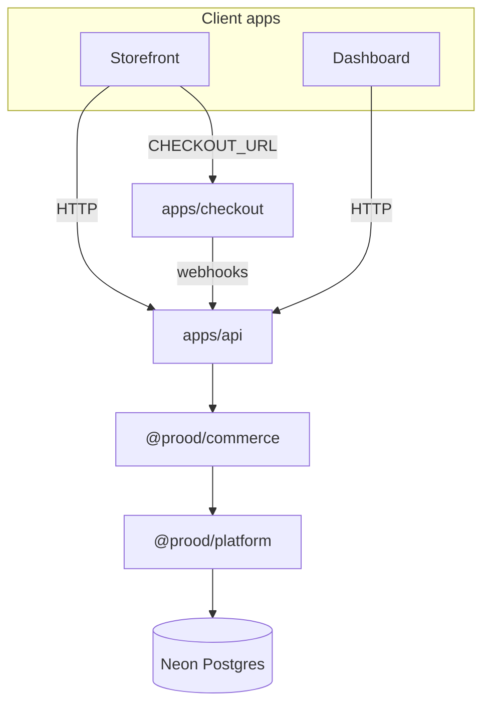

Welcome to the **Prood** documentation. Prood helps you **sell your products online**: create a store, go live on `yourname.prood.app`, manage catalog and orders in the dashboard, and accept payments through Stripe and regional providers.

Under the hood, Prood is a multi-tenant commerce platform (Next.js 16, Neon Postgres, pluggable payments). Each merchant is a Better Auth **organization** with isolated data via **row-level security (RLS)**.

<Cards>
  <Card title="For merchants" href="/docs/guides/for-merchants" description="What you can do today and how to launch your first store." />
  <Card title="For agencies" href="/docs/guides/for-agencies" description="Run many client stores with isolated tenants and domains." />
  <Card title="Getting started" href="/docs/getting-started" description="Install, configure env vars, and run locally." />
  <Card title="Merchant onboarding" href="/docs/guides/merchant-onboarding" description="Register to go-live in about an hour." />
</Cards>

## What is Prood?

Prood is a **commerce platform** for creators, brands, and agencies—not just a code template. You get:

- A **customer storefront** (catalog, cart, checkout, accounts)
- A **merchant dashboard** (products, orders, integrations, domains, team)
- A **hosted checkout** app (Stripe, Easypay, Ifthenpay)
- A **Commerce API** with OpenAPI, MCP, and Agent Auth for automation

You can swap payment providers and storage backends per store without rewriting your apps.

## Monorepo applications

| App | Port | Purpose |
| --- | --- | --- |
| `storefront` | 3000 | Customer-facing store — catalog, cart, checkout redirect, account |
| `web` | 3001 | Marketing site (prood.com) |
| `dashboard` | 3002 | Merchant admin — products, orders, integrations, domains, team |
| `docs` | 3003 | This documentation site (Fumadocs + OpenAPI) |
| `checkout` | 3004 | Hosted payment app — Stripe, Easypay, Ifthenpay |
| `api` | 3005 | Commerce REST API (`/v1/*`), MCP server, Agent Auth |

## Core packages

| Package | Role |
| --- | --- |
| `@prood/types` | Unified domain types and provider interfaces |
| `@prood/platform` | Built-in commerce engine (Neon Postgres + Drizzle + RLS) |
| `@prood/commerce` | Server-only data layer wrapping the adapter and providers |
| `@prood/checkout` | Framework-agnostic checkout state machine |
| `@prood/checkout-host` | Next.js session host (Upstash Redis) |
| `@prood/api-client` | Typed OpenAPI fetch client |
| `@prood/ui` | shadcn/Radix + 33+ commerce UI components |

## How data flows

The **storefront** and **dashboard** call the **Commerce API** via `@prood/api-client`. Only `apps/api` (and dashboard integration helpers) invoke `@prood/commerce`, which scopes every query to the active tenant with `withTenant()`.

## Key concepts

### Multi-tenancy

Each store is a Better Auth organization. The storefront resolves the tenant from the request **Host** header (custom domain or `{slug}.prood.app` subdomain). See [Multi-tenant platform](/docs/architecture/multi-tenant).

### API-centric architecture

All commerce operations go through `apps/api` for consistent auth, OpenAPI contracts, and agent tooling. See [Upstream comparison](/docs/architecture/upstream-comparison).

### Checkout separation

Order placement happens on the storefront (via the API). Payment UI lives in `apps/checkout`, with sessions in **Upstash Redis**. Webhooks reconcile order status through the API.

## Next steps

<Cards>
  <Card title="Installation" href="/docs/getting-started/installation" description="Clone, install, migrate the database, and start dev servers." />
  <Card title="Quick start" href="/docs/getting-started/quick-start" description="Browse products, add to cart, and complete checkout." />
  <Card title="Pricing (marketing)" href="https://prood.com/pricing" description="Free, Grow, Scale, and Agency plans." />
  <Card title="Storefront guide" href="/docs/apps/storefront" description="Pages, cart BFF, tenant resolution, checkout." />
</Cards>
