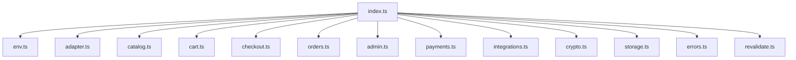

`@prood/commerce` is the **server-only data layer** used by `apps/api`. It wraps the configured `CommerceAdapter`, instantiates payment and storage providers, handles tenant scoping, and manages Next.js cache tags.

## Installation

```bash
pnpm add @prood/commerce
```

This package is `"server-only"` — it cannot be imported in client components.

## Usage

Only `apps/api` should import `@prood/commerce` directly. Other apps use `@prood/api-client`.

```ts
import {
  getProducts,
  createCart,
  placeOrder,
  getAdmin,
  withTenant,
  getPaymentProvider,
  verifyPaymentWebhook,
} from '@prood/commerce'
```

## Catalog functions

```ts
// Cached with per-tenant tags
const products = await getProducts(orgId, { query: 'shirt', page: 1, limit: 20 })
const product = await getProduct(orgId, 'prod_abc')
const categories = await getCategories(orgId)
const store = await getStoreInfo(orgId)
```

Cache tags: `products-{orgId}`, `categories-{orgId}`, `store-{orgId}`.

## Cart functions

```ts
const cart = await createCart(orgId)
const updated = await addCartItem(orgId, cartId, { productId, variantId, quantity: 1 })
await applyCartCoupon(orgId, cartId, 'SAVE10')
const order = await placeOrder(orgId, cartId)
```

## Admin functions

```ts
const admin = getAdmin(orgId)
const products = await admin.listProducts({ page: 1 })
const created = await admin.createProduct(input)
await admin.fulfillOrder(orderId, { trackingNumber: 'TRK123' })
await admin.refundOrder(orderId, { amount: 5000, reason: 'Customer request' })
const stats = await admin.getDashboardStats()
```

## Payment providers

```ts
// Build provider with tenant config or configured environment defaults
const provider = await getPaymentProvider('stripe', orgId)

// Verify webhook with tenant's stored secret
const result = await verifyPaymentWebhook(payload, signature, 'stripe', orgId)
```

Provider factory reads from the encrypted `integration_config` table and falls back to configured environment defaults for fields that are not stored per tenant.

## Storage

```ts
import { uploadForTenant, tenantStorageDirectory } from '@prood/commerce'

const result = await uploadForTenant(orgId, {
  file: buffer,
  filename: 'product-image.jpg',
  contentType: 'image/jpeg',
  directory: tenantStorageDirectory(orgId, 'products', productId),
})
// result.url → CDN URL
// result.key → org/{orgId}/products/{productId}/...
```

## Encryption

Integration credentials are encrypted at rest:

```ts
import { encryptConfig, decryptConfig } from '@prood/commerce'

const encrypted = encryptConfig({ secretKey: 'sk_live_...' })
// → { secretKey: 'enc:v1:...' }

const decrypted = decryptConfig(encrypted)
// → { secretKey: 'sk_live_...' }
```

Uses AES-256-GCM with `INTEGRATION_ENCRYPTION_KEY`. The key is required.

## Tenant scoping

All functions accept `orgId` as the first parameter and call `withTenant()` internally:

```ts
export async function getProducts(orgId: string, params: SearchParams) {
  return withTenant(orgId, () => adapter.getProducts(params))
}
```

## Configuration

Read via `getCommerceConfig()`:

| Setting | Env var | Default |
| --- | --- | --- |
| Currency | `COMMERCE_CURRENCY` | `EUR` |
| Storage | `STORAGE_PROVIDER` | `vercel-blob` |
| Payment | `DEFAULT_PAYMENT_PROVIDER` | `stripe` |

## Module structure



## Related pages

<Cards>
  <Card title="@prood/platform" href="/docs/packages/platform" description="Underlying Postgres engine." />
  <Card title="Commerce API" href="/docs/apps/api" description="HTTP layer consuming this package." />
  <Card title="Payment providers" href="/docs/packages/payments/stripe" description="Payment provider packages." />
</Cards>
